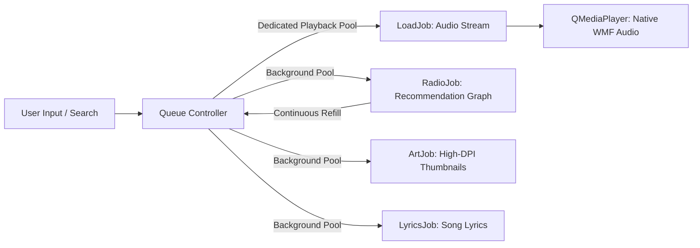

<div align="center">

<br/>

# 🕯️ &nbsp;E m b e r

### *The cozy floating desktop music companion that refuses to get in your way.*

<p align="center">
  <em>Slim as a ribbon &nbsp;·&nbsp; Warm as lamplight &nbsp;·&nbsp; Endlessly yours</em>
</p>

<p align="center">
  
  
  
  
  
</p>

<br/>

<table>
  <tr>
    <td align="center" style="border: none; padding: 14px;">
      <p><strong>Compact Desk Ribbon</strong></p>
      
      <br/>
      <sub><em>Tucks neatly above your code, terminal, or browser without stealing focus</em></sub>
    </td>
    <td align="center" style="border: none; padding: 14px;">
      <p><strong>Expanded Studio Panel</strong></p>
      
      <br/>
      <sub><em>Full queue management, live lyrics, vinyl mechanics & theme selection</em></sub>
    </td>
  </tr>
</table>

<br/>

</div>

---

<br/>

## ☕ &nbsp; The Essence

Most music applications demand half your screen, nag you with notifications, and swallow hundreds of megabytes of RAM. 

**Ember** is built on an entirely different philosophy: **quiet presence**.

- 🌙 **Floats seamlessly** over your code editor, document, or game window.
- 🕯️ **Warm organic palette** designed specifically for late-night creative flow and tired eyes.
- ⚡ **Zero-latency playback** that streams directly from the cloud without storing gigabytes of bloat.
- 🎧 **Never steals keyboard focus** — control everything with gentle global hotkeys or tray presence.

<br/>

---

<br/>

## ✨ &nbsp; The Experience

| &nbsp;&nbsp;&nbsp;&nbsp;&nbsp;&nbsp; Feature &nbsp;&nbsp;&nbsp;&nbsp;&nbsp;&nbsp; | The Vibe &amp; Craft |
|:---|:---|
| 🔍 **Search & Paste** | Type any track title, artist name, or drop a direct YouTube / YouTube Music link straight in. Debounced at 350ms so typing stays light and instant. |
| 🎤 **Live Lyrics Tab** | Sing along with real-time lyrics fetched quietly in the background, complete with source credits and selectable text. |
| 🌙 **Sleep Timer** | Drift off peacefully with 15m, 30m, 45m, or 60m countdown presets featuring an automatic 15-second gentle volume fade to zero. |
| 🔀 **Smart Shuffle & Repeat** | Non-destructive upcoming queue shuffle that keeps your history intact, plus 3-way cycleable repeat modes (`off` ➔ `all` ➔ `one`). |
| ⚡ **Variable Speed** | Seamlessly dial playback rate between `0.75x`, `1.0x`, `1.25x`, and `1.5x` with native audio pitch preservation. |
| 🪟 **Desktop Glass Opacity** | Dial the window translucency between 60% and 100% to let your desktop wallpaper bleed gently through. |
| ♾️ **Endless Queue** | Autonomous recommendation graph that feeds matching tracks behind your seed song so the silence never intrudes. |
| 🎛️ **Hand-Crafted Instruments** | Rotating vinyl disc with dynamic specular sheen, fluid spring-damper equalizer bars, and a cozy drag-to-set circular volume dial. |
| 💾 **SQLite Local Memory** | Pinned favorites (`♡` / `♥`) and listening history saved securely in a lightweight local database (`ember.db`). Zero external dependencies. |
| 🎨 **Dynamic Palette Switcher** | Swap instantly between five hand-curated themes (`Amber`, `Emerald`, `Amethyst`, `Solar`, `Rose`) with live runtime UI restyling. |
| 🍞 **Ghost Toast** | A quiet, non-focus-stealing floating toast notification with album art that slides in only when tracks change. |
| ⌨️ **Universal Hotkeys** | Global key chords for every common action, fully customizable with conflict detection for Windows shortcuts. |

<br/>

---

<br/>

## 🎨 &nbsp; Handcrafted Theme Palettes

Ember ships with 5 unified color stories inspired by natural stones and ambient warmth:

```
  🕯️ Amber     │ Deep espresso base, roasted coffee, and luminous golden amber light
  🌿 Emerald   │ Forest moss, midnight pine, and radiant emerald glow
  🔮 Amethyst  │ Velvet twilight, dark slate, and deep mystical violet luminescence
  ☀️ Solar     │ Sun-baked terracotta, warm earth, and bright solar radiance
  🌸 Rose      │ Smoky plum, evening rouge, and delicate soft blush accents
```

> *Every widget, vinyl reflection, text label, and progress slider re-skins instantly at runtime without restarting the application.*

<br/>

---

<br/>

## 🚀 &nbsp; Quickstart

Ember is engineered specifically for **Windows 10 & 11** using Windows Media Foundation (WMF) pipelines and native Win32 window positioning.

### 🌟 The One-Click Way (Recommended)

```bat
install.bat
```
*Creates an isolated `.venv` and installs all dependencies automatically. Your system Python stays untouched.*

```bat
launch.bat
```
*Launches Ember quietly in the background without keeping a console window open.*

*(Prefer live console logs while tinkering? Run `launch_debug.bat` instead.)*

<br/>

### 🛠️ The Manual Way

```bat
# 1. Clone the repository
git clone https://github.com/AIwolfie/Ember.git
cd Ember

# 2. Set up virtual environment
python -m venv .venv
.venv\Scripts\python.exe -m pip install -r requirements.txt

# 3. Launch the player
.venv\Scripts\pythonw.exe -m ember
```

<br/>

---

<br/>

## ⌨️ &nbsp; Default Hotkeys Cheatsheet

Control your soundtrack from inside any application, IDE, or full-screen game:

<div align="center">

| Shortcut | Action | Scope |
|:---|:---|:---:|
| <kbd>Ctrl</kbd> + <kbd>Alt</kbd> + <kbd>Space</kbd> | Play &nbsp;/&nbsp; Pause | Global |
| <kbd>Ctrl</kbd> + <kbd>Alt</kbd> + <kbd>→</kbd> | Next Track | Global |
| <kbd>Ctrl</kbd> + <kbd>Alt</kbd> + <kbd>←</kbd> | Previous Track (or restart current) | Global |
| <kbd>Ctrl</kbd> + <kbd>Alt</kbd> + <kbd>E</kbd> | Toggle Expanded Panel | Global |
| <kbd>Ctrl</kbd> + <kbd>Alt</kbd> + <kbd>↑</kbd> | Expand Ribbon to Panel | In-App |
| <kbd>Ctrl</kbd> + <kbd>Alt</kbd> + <kbd>↓</kbd> | Collapse Panel to Ribbon | In-App |
| <kbd>Ctrl</kbd> + <kbd>Alt</kbd> + <kbd>F</kbd> | Jump to &amp; Focus Search Field | In-App |

</div>

> 💡 *Tip: All key combinations can be freely re-mapped in the `⚙` Preferences dialog.*

<br/>

---

<br/>

## 🏛️ &nbsp; Architecture & Engineering

```
Ember/
├── ember/
│   ├── app.py             → Application lifecycle, rotating logs, hotkey hooks
│   ├── catalog.py         → YouTube Music guest API with exponential backoff
│   ├── config.py          → Palette tokens, geometry constants, design tunables
│   ├── icons.py           → FontAwesome 6 vector icons with dynamic tinting
│   ├── jobs.py            → Asynchronous QRunnable workers with isolated thread pools
│   ├── models.py          → Song dataclass & serialization contracts
│   ├── panel.py           → Floating surface, ribbon, tabs, search debounce & canvas
│   ├── player.py          → PlaybackCore, queue manager & auto-recovery engine
│   ├── settings_dialog.py → Preferences modal, hotkey binder & theme manager
│   ├── storage.py         → Persistent SQLite engine for favorites & playback history
│   ├── stream.py          → Direct audio stream extraction with yt-dlp
│   ├── theme.py           → Dynamic Qt stylesheets compiled with string.Template
│   ├── toast.py           → Non-intrusive floating desktop notification toast
│   ├── tray.py            → System tray icon & single-instance lock guard
│   └── utils.py           → Formatters, clock helpers, and text elision
├── tests/                 → Automated pytest suite (models, palette, storage, resilience)
├── install.bat            → Automated Windows environment installer
├── launch.bat             → Clean silent application launcher
├── launch_debug.bat       → Diagnostic console launcher
├── requirements.txt       → Pinned dependency specifications
├── CREDITS.md             → Full project attribution
└── LICENSE                → MIT License
```

<br/>

### ⚡ Thread Isolation Model

Audio decoding never waits on network queries. Tasks are decoupled across **dedicated thread pools**:



<br/>

---

<br/>

## 🧪 &nbsp; Verification & Testing

Ember features a comprehensive automated test suite covering models, themes, database integrity, and resilience:

```bat
.venv\Scripts\python.exe -m pytest tests/ -v
```

<br/>

---

<br/>

## 🤝 &nbsp; Attribution & Credits

Ember is built with care, craft, and love for music:

- **Mayank Malaviya** ([@AIwolfie](https://github.com/AIwolfie)) — *Original creator, lead architect, and maintainer of Ember.*
- **Muhammad Taezeem Tariq Matta** ([@taezeem14](https://github.com/taezeem14)) — *Contributor — development improvements and project upgrades.*

For full details, see [CREDITS.md](CREDITS.md).

<br/>

---

<br/>

<div align="center">

### Distributed under the [MIT License](LICENSE)

<sub><em>Crafted for late nights, cold tea, and warm code. Enjoy the sound. 🎵</em></sub>

</div>
