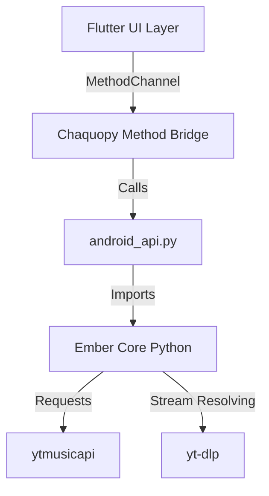

# Ember Android Architecture

This document describes the architecture of the Ember Android application, an extension of the Ember Windows application that brings a custom YouTube Music-inspired experience to mobile devices.

## High-Level Architecture

The Ember Android app bridges a modern, high-performance **Flutter** interface with our existing **Python** ecosystem using **Chaquopy**. This dual-layer architecture ensures we reuse our robust catalog and stream resolution logic without locking the UI into Python's graphics limitations on mobile.

## Layer Breakdown

### 1. The Flutter UI Layer (`ember_flutter/lib/`)
The front-end user experience is built entirely in Flutter, providing a 120hz-capable, dynamically styled interface. We implemented a YouTube Music-inspired design system with:
- **Dynamic Aesthetic**: Album art derived gradients and immersive Full Player layouts.
- **Advanced Grids**: Algorithmic home screen with varying grid densities depending on category.
- **Smart UI Rendering**: The `MiniPlayer` layout intelligently embeds directly inside the native framework Scaffold column alongside the Navigation Bar, permanently solving overlapping and scaling UI conflicts across heavily fragmented Android device ratios.
- **Search AI Utility**: A standalone `SearchAlgorithm` layer decoupled from business UI, which dynamically intercepts remote API fuzzy returns. It forcefully hoists mathematically precise song matches, actively fetches parallel Artist identities, and structurally clusters metadata for an optimized UX.

### 2. The Communication Bridge (Chaquopy + MethodChannels)
Because Python handles the actual business logic, Flutter and Python communicate via Android's native `MethodChannel`.
- **Flutter calls:** standard MethodChannels (`MethodChannel('com.ember.app/bridge')`).
- **Android Native (Kotlin/Java):** Receives the channel request and delegates it to Chaquopy.
- **Chaquopy:** Uses the embedded Python VM to invoke the corresponding function in our Python wrapper script (`android_api.py`).

### 3. The Python API Wrapper (`android_api.py` & `catalog.py`)
This is the boundary between the Android environment and the core Ember Python code. It translates serialized arguments from Flutter into proper Python invocations.
- Handles `init_api()` to set up logging, cache, and session data.
- **Dynamic Resolvers**: Extends generic payloads allowing automatic recursive cataloging across Tracks, Playlists, Albums, and Podcasts dynamically.
- Manages exceptions gracefully, passing them back as structured errors rather than hard-crashing the VM.

### 4. Core Python Backend
This is the same backend used by the desktop app, ensuring feature parity.
- **ytmusicapi**: Handles expansive catalog browsing, metadata fetching, and intelligent charting configurations.
- **LRCLib REST Integration**: Actively bridges precise, timestamped `.lrc` lyric files through native REST parsing directly into the Flutter Player UI over the Bridge.
- **Stream Resolver**: Evaluates and caches streaming endpoints.

## Build and Dependency Management
The `build.gradle` of the Android app is uniquely configured to bundle the Python environment.
- **pip requirements:** Chaquopy's block in `build.gradle` explicitly lists `ytmusicapi` and other essential dependencies.
- During build, these dependencies are compiled/downloaded and bundled inside the APK.
- **Url Launcher:** Integrates external intent hooks exclusively managed at the native configuration level.

## Future Recommendations
- **Audio Lifecycle Integration**: Map Android's MediaSession strictly to the Flutter/Python state, ensuring background playback is completely native.
- **Unified Testing**: Create integration tests that verify JSON serialization integrity between Flutter's Dart dataclasses and Python's Dictionary returns.
